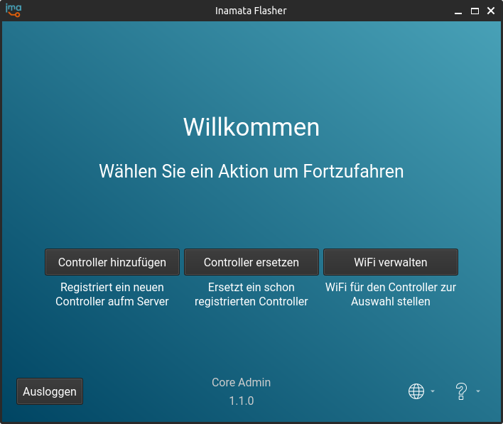
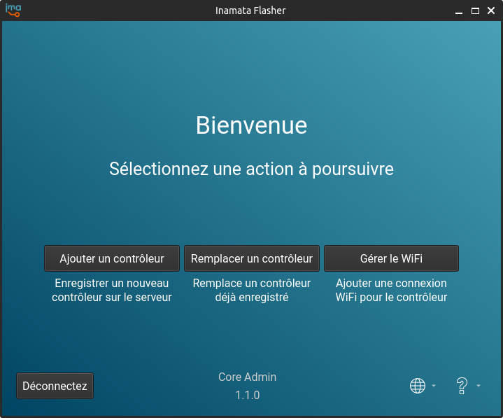

[][10]

# Inamata Flasher

Flash the firmware onto an ESP32 and register it with the server. Released for the [Inamata IoT platform][10].

[Download](#download) | [Driver Setup](#driver-setup) | [Languages](#languages) | [Snap Setup](#optional-snap-setup) | [Development](doc/development.md) | [Known Issues](doc/known_issues.md)

[][11]
[](https://snapcraft.io/inamata-flasher)

## Screenshots

| Windows Screenshots                                 | Linux Screenshots                                      |
| --------------------------------------------------- | ------------------------------------------------------ |
|  |  |
| Welcome page for Windows 10 → [more pages][1]       | Add controller page for Ubuntu 22.04 → [more pages][2] |

## Download

### Windows

For Windows download the [latest setup installer][11].

### Linux

For Linux use the [Snap download][9] to receive automatic updates.

### Older and Standalone Versions

Older and standalone versions are available on the [GitHub releases page][8]. The app is available via the following channels:

|              | GitHub Release | Snap Store | Installer  | Source |
| ------------ | -------------- | ---------- | ---------- | ------ |
| **Linux**    | Yes            | Yes        | No         | Yes    |
| **Windows**  | Yes            | No         | Yes        | Yes    |
| **Packager** | PyInstaller    | Snap       | Inno Setup | None   |

## Driver Setup

### Windows

Download and install the [CP210x USB to UART Bridge driver][4] from [silabs.com][3]. Additional information is provided by Espressif:

- [Establish Serial Connection with ESP32][12]
- [Flash Using UART][13]

In rare cases you might require the [FTDI driver][14]. This is used on some developer boards.

### Linux

1. Add your Linux user to the dialout group to gain access to the serial USB port. Run the following command in a terminal:

    `sudo usermod -a -G dialout $USER`

2. Now logout and back in again. To verify the change run the following command:

    `groups`

## Languages

The application is available in
- 🇬🇧 🇺🇸 English
- 🇩🇪 German
- 🇫🇷 French
- 🇪🇸 Spanish

The translations have been created with the help of translation software as well as a mixture of native and non-native speakers. If you find any translation errors, we'll gladly accept merge requests or an e-mail (info@inamata.io) with the mistranslated strings. Instructions for translators are available in the [development doc](doc/development.md#Internationalization).

| German                                                                  | French                                                                  |
| ----------------------------------------------------------------------- | ----------------------------------------------------------------------- |
|  |  |

## Optional Snap Setup

To enable saving the authentication token between restarts run the following command in a terminal:

```
snap connect inamata-flasher:password-manager-service
```

## Future Features

This is a list of features that would be useful and show the tool's current limitations

- Handling of more than 100 site, firmware images or controller instances
  - This is due to not handling paging of the GraphQL requests
- Delete controller when creating a new on and an error occurs after registration
- Enable searching of combo boxes with many items
  - This is described on [StackOverflow](https://stackoverflow.com/questions/4827207/how-do-i-filter-the-pyqt-qcombobox-items-based-on-the-text-input)
- Use PlatformIO as an flash/upload tool?: https://community.platformio.org/t/upload-latest-build-without-a-compile-link/9520

[1]: screenshots/windows.md
[2]: screenshots/linux.md
[3]: https://www.silabs.com/developers/usb-to-uart-bridge-vcp-drivers
[4]: https://www.silabs.com/documents/public/software/CP210x_Universal_Windows_Driver.zip
[6]: https://github.com/espressif/arduino-esp32/blob/master/libraries/LittleFS/library.properties
[8]: https://github.com/InamataIO/Flasher/releases/latest
[9]: https://snapcraft.io/inamata-flasher
[10]: https://www.inamata.io
[11]: https://github.com/InamataIO/Flasher/releases/latest/download/inamata_flasher_setup.exe
[12]: https://docs.espressif.com/projects/esp-idf/en/v4.3-beta2/esp32/get-started/establish-serial-connection.html
[13]: https://docs.espressif.com/projects/esp-idf/en/latest/esp32/get-started/establish-serial-connection.html
[14]: https://ftdichip.com/drivers/vcp-drivers/